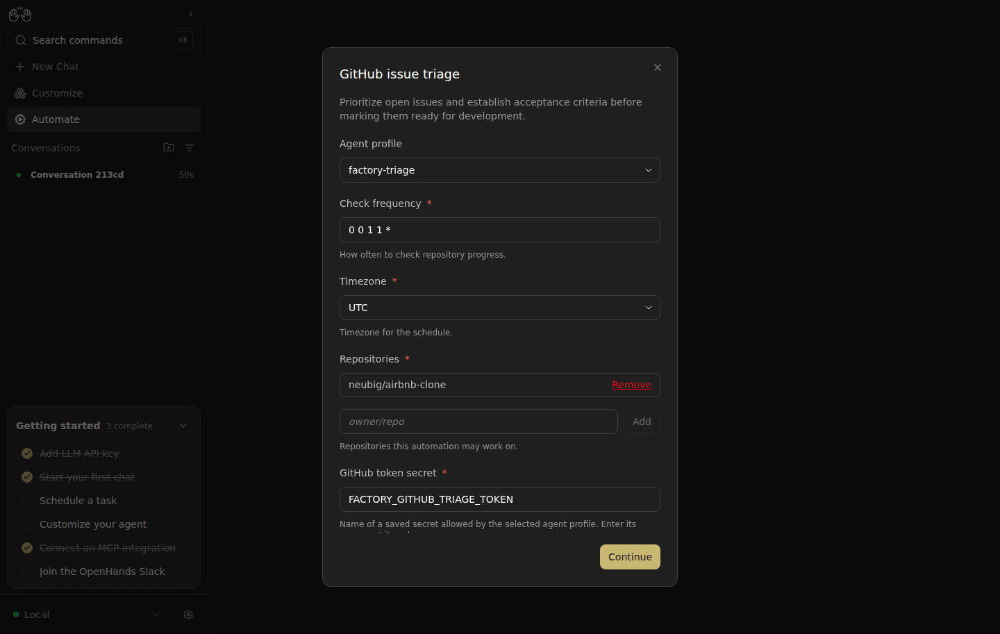

# Canvas #17396: live evidence

Captured 2026-09-13 through real browser interaction with real Canvas, Agent Server, and Automation services. No UI or API response mocks.

The same triage template was configured through UI with `factory-triage`, confirmed, created, and immediately paused. Before, the saved detail showed **LLM profile: Active profile** and the private database had `agent_profile_id=null`. After, it showed **Agent profile: factory-triage**, and the request/database contained profile `07527f65-27d8-4cd3-91ed-721694a789f6`. The first definition was deleted through UI before repeating the same form to avoid existing duplicate-definition behavior. Both used January 1 schedules; no automation ran. The GIF shows three before frames followed by three after frames. Import/export and missing-profile behavior remain covered separately by tests.

## Versions and isolation

Fixed Canvas integration: `a3c7915db5f47800f5240a25987b2af75b0d8d04`. Negative-control integration: `204c1845b9643ce4f190bbd6d20a5d50a117fafa`, built from the same integration with `384aceccb` (bundle profile), `ea0eeaa7e` (plugin admission), and `f3863942c` (asset lookup) reverted. This is an integration comparison with required unreleased dependencies, not a standalone released-main claim. Each trigger is independent: triage uses no plugin source; plugin admission stops before automation creation; asset replacement creates neither profiles nor automations.

SDK `ac6d12b0b9d76f1cc38a6eb1ea51cd92e34a0bf2`; Automation `8abaa0b5fdea18132c68ef71dfd645c5aafcc13a`. Private Canvas ports 9106/9107, SDK 19107, Automation 19106. Settings were copied into a private directory; all writes thereafter used private services. The production factory was untouched. No model or automation job ran in this stack, and all four private processes were stopped after capture.

Supporting allowlisted observations: [profile-before-db.json](profile-before-db.json), [profile-after-db.json](profile-after-db.json), [profile-payload.json](profile-payload.json).
