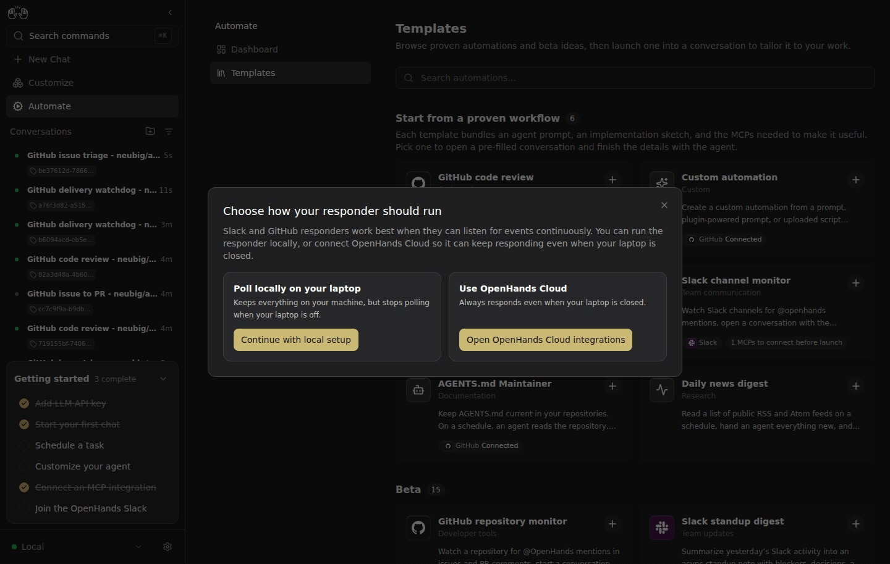

# Canvas #17403: live evidence

Captured 2026-09-13 through real browser interaction with real Canvas, Agent Server, and Automation services. No UI or API response mocks.

In Automate → Templates, select **GitHub code review** and choose **Continue with local setup**. Before, Canvas rejects the plugin source and opens an empty assisted conversation containing `/pr-reviewer:setup`. After, the same interaction opens `/automations/new/github-pr-reviewer` and its direct form. The GIF shows selection/failure first, then selection/success. The empty private conversation was never sent to the model. This demonstrates bundle admission, not execution of the reviewer; running-factory review evidence is separate.

## Versions and isolation

Fixed Canvas integration: `a3c7915db5f47800f5240a25987b2af75b0d8d04`. Negative-control integration: `204c1845b9643ce4f190bbd6d20a5d50a117fafa`, built from the same integration with `384aceccb` (bundle profile), `ea0eeaa7e` (plugin admission), and `f3863942c` (asset lookup) reverted. This is an integration comparison with required unreleased dependencies, not a standalone released-main claim. Each trigger is independent: triage uses no plugin source; plugin admission stops before automation creation; asset replacement creates neither profiles nor automations.

SDK `ac6d12b0b9d76f1cc38a6eb1ea51cd92e34a0bf2`; Automation `8abaa0b5fdea18132c68ef71dfd645c5aafcc13a`. Private Canvas ports 9106/9107, SDK 19107, Automation 19106. Settings were copied into a private directory; all writes thereafter used private services. The production factory was untouched. No model or automation job ran in this stack, and all four private processes were stopped after capture.
