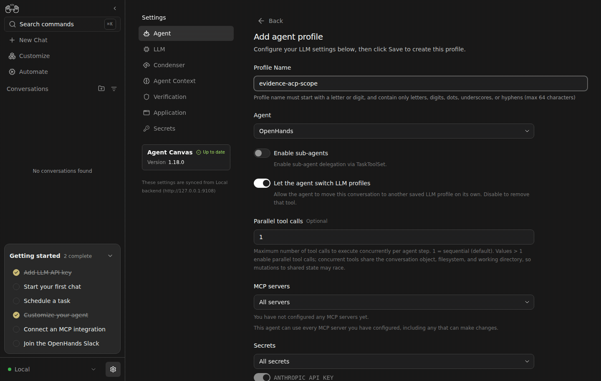
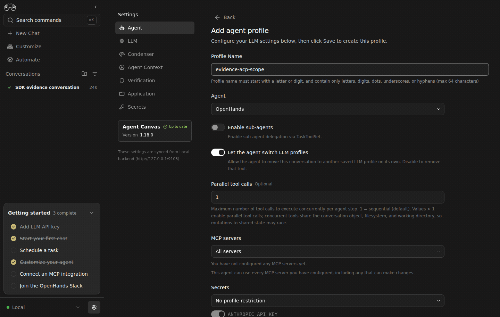

# Live Canvas: preserve an ACP profile's secret selection

| Before | After |
| --- | --- |
|  |  |

Reopening a saved ACP profile must not add credentials the user explicitly excluded. The previous provider-seeding effect ran during profile loading; renaming and saving that profile could therefore widen its persisted secret allowlist. The fix seeds defaults only in the existing explicit scope/provider/command handlers.

The before/after comparison uses real Canvas and Agent Server, with two synthetic secrets: `ANTHROPIC_API_KEY` and `EVIDENCE_ALLOWED`. Neither has account privileges. No ACP agent or model is started. Every settings and profile change uses the UI; the read-only persistence check records names and scope fields only.

Reproduction:

1. Save both synthetic secrets through Settings → Secrets.
2. Add an ACP profile using Claude Code. Choose secrets, then explicitly clear `ANTHROPIC_API_KEY` and select only `EVIDENCE_ALLOWED`. Save.
3. Reopen the profile. Before: the provider key is selected again. After: it remains cleared.
4. Change only the profile name and save. Reopen and inspect the persisted `secret_refs`. Before: the provider key has been added. After: only `EVIDENCE_ALLOWED` remains.

The same recording shows the revised default-scope text. `null` retains the existing API meaning: it does not restrict secrets supplied at launch, and it does not inject all saved secrets into profile-only automation launches. Automations must explicitly select the secrets they need.

The existing PR's earlier selected/empty OpenHands profile demonstration remains separate evidence. This comparison specifically covers ACP deselection, reopening, and unrelated edits. Server enforcement, Docker credential isolation, and real ACP authentication are separate scenarios.

Regression tests fail on the previous head and pass with the fix. The full route file has 49 passing tests, including empty/selected saved scopes, save/reopen after deselection, explicit scoping defaults, and provider changes through both the preset selector and command input. Focused lint, staged typecheck, and all15 translation completeness checks passed.

Before assets: `4cd1513bbe74abd2c1f9e58a77cf64375aafe001`, containing prior picker revision `20c30a2a24e985ee904b929738f878a43c023c41`. After assets: `9874c820a23e4026483ad9540ec9cb56194ce3ec`, containing fixes `3b1065500` and `21d062fa9`. Both use SDK `ac6d12b0b9d76f1cc38a6eb1ea51cd92e34a0bf2`. The integrated after build also contains independent diagnostic-file and onboarding fixes; neither handles ACP profile secret selection.

The saved before profile contains `secret_refs=["ANTHROPIC_API_KEY", "EVIDENCE_ALLOWED"]`; after contains only `["EVIDENCE_ALLOWED"]`. No real secret values are published. [Exact revisions and persisted scope](evidence.json); primary [before](before-persisted-scope.png) and [after](after-persisted-scope.png) images.

The local evidence launcher starts an Agent Server with separate empty `OH_PERSISTENCE_DIR` and `OH_CONVERSATIONS_PATH` directories, then serves each static build through `node scripts/static-server.mjs --host 127.0.0.1 --port 9108 --dir <build>` with `/api`, `/server_info`, `/health` and `/sockets` routed to that private SDK. Configure a dummy model through onboarding, then follow the UI steps above. No ACP process is launched. Full scripts and original screenshots remain in `/home/gneubig/work/factory-state/evidence/secret-scope-preservation` and `sdk-stalls/{secret-scope-before,onboarding-after}`.

Each GIF uses the five original screenshots, two seconds per frame; elapsed playback is condensed. Private services were stopped and proof tabs closed after capture. The after backend first served the separate onboarding proof, so its completed OpenHands conversation can appear in the sidebar. It is not ACP execution evidence.
